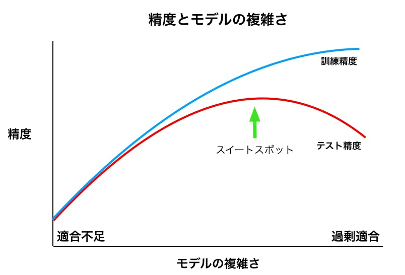

# 2章　教師あり学習
教師あり学習を行うには、訓練セットを作るために人でが必要になるが、

ひとたび学習が終われば、非常に人手がかかるタスクを高速化したり、不可能なタスクを可能にする。

## 2.1 クラス分類と回帰
1. クラス分類(classification)
目的：あらかじめ定められた選択肢の中から**クラスラベル**を予測すること

- 2クラス分類
  - 2つだけのクラスを分離する問題
  - 答えがyes/noになる問に答える問題ともいえる。
  - 一方のクラスを**陽性(positive)**クラス, もう一方を**陰性(negative)**クラスという。
  (どちらを陽性と呼ぶかは主観的な問題)
- 多クラス分類
  - 3つ以上のクラスを分離する問題

2. 回帰(regression)
目的：連続地の予測

※プログラミングでは、**浮動小数点(float-point number)**

※数学では、**実数(real number)**

「タスク例」
- ある人の年収を学歴と年齢と住所から予測する。
- トウモロコシ農家の収穫量を、前年の収穫量、天候、従業員数から予測する。

#### クラス分類と回帰問題の区別
- 出力に何らかの連続値があるかを考えてみればよい。

## 2.2 汎化、過剰適合、適合不足
機械学習モデルが未見のデータに対して正確に予想ができるなら、

訓練セットを用いてテストセットに対して**汎化(generalize)**できているという。

>[Pythonでリッジ回帰を実装](https://qiita.com/kotamatsukun/items/1ccb41ca278e400b6197)より引用

非常に複雑なモデルを作ると、訓練データに対してはいくらでも正確な予測を行うようにできる。

- **過剰適合(過学習: over fitting)**：持っている情報量に比べて複雑なモデルを作ってしまうこと
  - 訓練セットの個々の特徴にモデルを適合しすぎると発生する。
  - 訓練セットに対してはうまく機能するが、新しいデータに対しては汎化できないモデルになる。
- **適合不足(under fitting)**：単純すぎる問題を選択してしまうこと。
  - 単純すぎるモデルではデータの様々な側面やデータの変異をとらえることができない。

最良の汎化性能を示すスイートスポットが、我々の求めるモデル！

### 2.2.1 モデルの複雑さとデータセットの大きさ
モデルの複雑さは、訓練データセットが持つ入力のバリエーションに密接に結びついている。

データセットに含まれるデータポイントがバリエーションに富んでいれば、過剰適合を起こすことなく、より複雑なモデルを利用できる。

通常は、データポイントが増えればデータのバリエーションも増えるので、データセットが大きくなれば、より複雑なモデルが利用できるようになる。

※同じデータポイントを複製したり、似たようなデータを集めるのではダメ

※モデルを弄り回すよりもデータ量を増やしたほうがよい場合も多い。

## 2.3 教師あり機械学習アルゴリズム
- モデルの複雑さという概念が個々のモデルで果たす役割
- 個々のアルゴリズムが、モデルを構築する方法の概要
- アルゴリズムの長所
- アルゴリズムの短所
- 適しているデータの種類
- 重要なパラメータとオプション
について以降まとめる。

